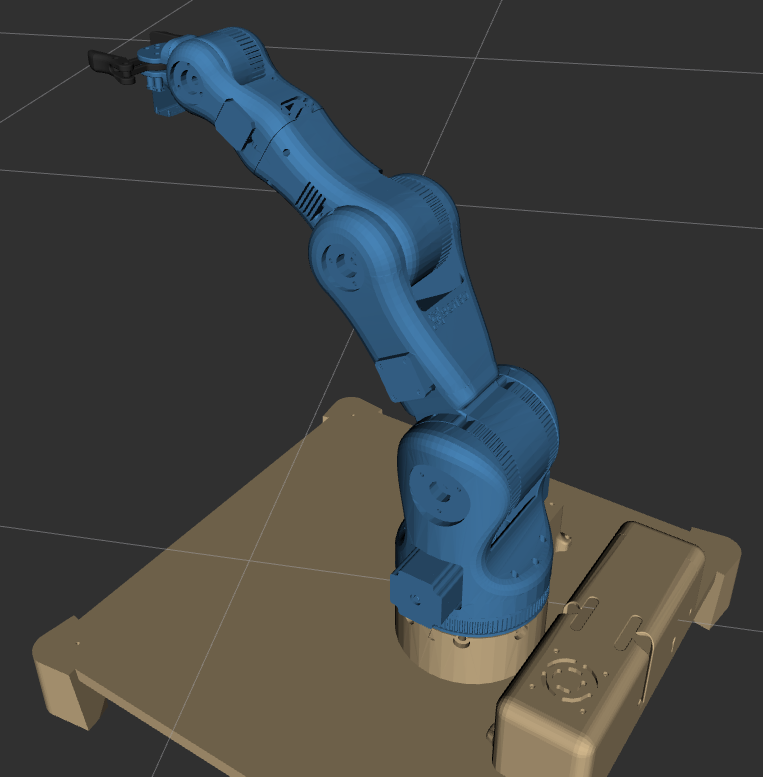
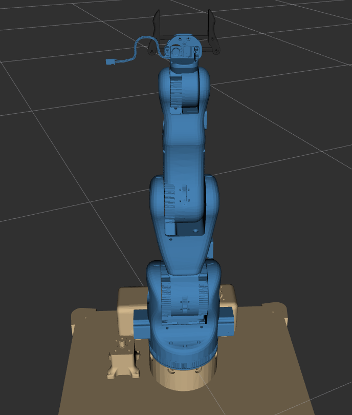
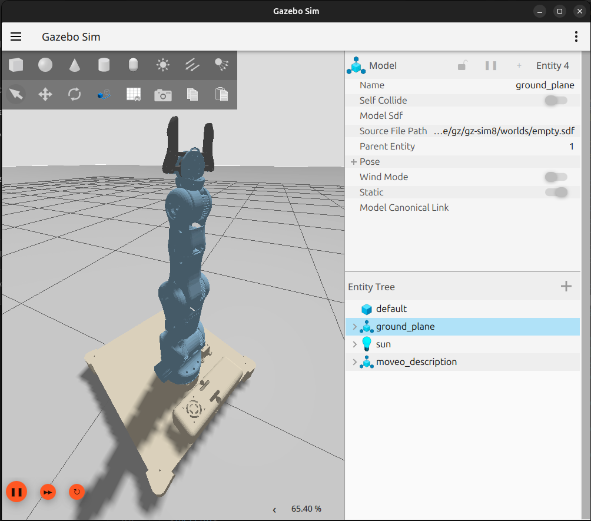
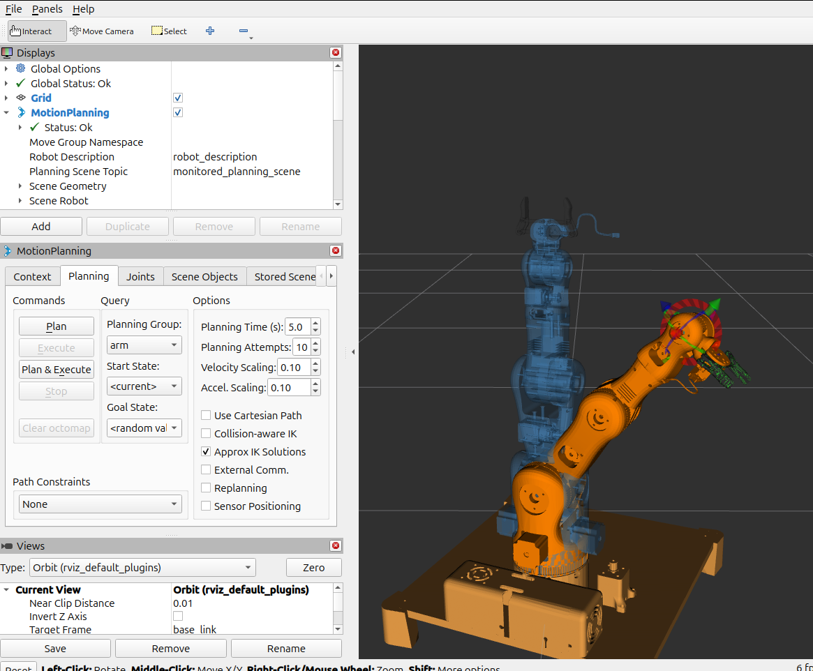
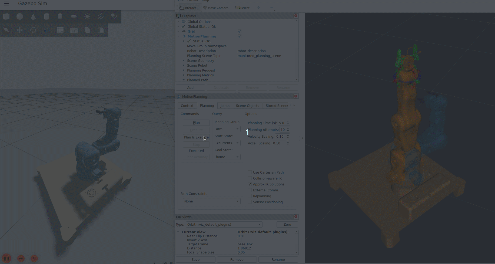
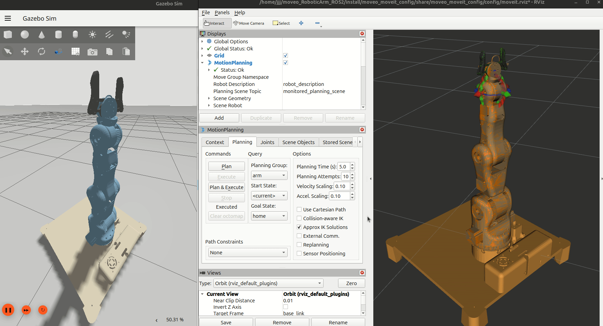
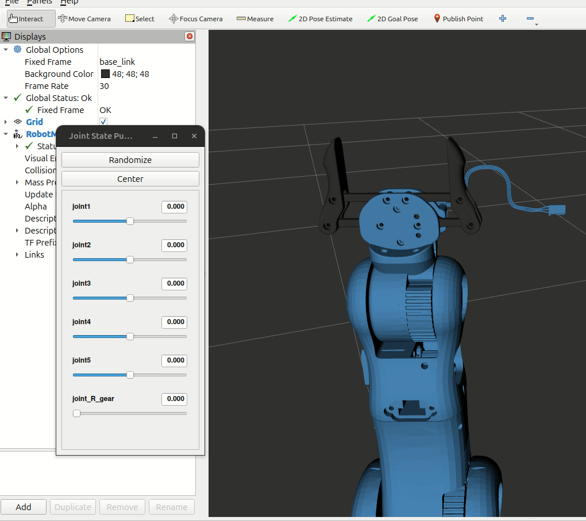

# Moveo Robotic Arm with ROS2

<p align="center">
  <a href="LICENSE"></a>
  <a href="https://docs.ros.org/en/jazzy/"></a>
  <a href="https://ubuntu.com/"></a>
  <a href="https://www.docker.com/"></a>
</p>

<p align="center">
  
  
</p>

## What is Moveo?

A complete ROS2 simulation and control framework for the **5-DOF Moveo collaborative robotic arm**. This repository provides:
- **Full robot description** in URDF/Xacro with physics simulation
- **Motion planning** using MoveIt2 and OMPL algorithms
- **Gazebo simulation** for testing before hardware deployment
- **Real-time visualization** in RViz with trajectory planning
- **Gripper control** for pick-and-place manipulation tasks

Perfect for robotics research, education, and autonomous manipulation workflows.

## Quick Start

### Run the simulator
```bash
ros2 launch moveo_bringup moveo.launch.py
```

This opens Gazebo (physics simulator) and RViz (motion planner interface). Plan and execute arm movements interactively.

## Table of Contents
1. [Installation](#installation)
2. [Project Structure](#project-structure)
3. [Usage](#usage)
4. [Customization](#customization)
5. [Key Features](#key-features)
6. [Acknowledgements](#acknowledgements)
7. [License](#license)

## Installation
### Prerequisites

- **Ubuntu 24.04** (or Docker for other versions)
- **ROS2 Jazzy Jalisco** installed
- **MoveIt2**, **Gazebo**, **RViz2** (typically installed with ROS2)

### Option A: Native Installation (Ubuntu 24.04 + ROS2 Jazzy)

1. **Clone the repository**
   ```bash
   git clone https://github.com/JJJau03/moveo_RoboticArm_ROS2.git
   cd moveo_RoboticArm_ROS2
   ```

2. **Build the workspace**
   ```bash
   colcon build
   ```

3. **Source the workspace**
   ```bash
   echo "source $(pwd)/install/setup.bash" >> ~/.bashrc
   source ~/.bashrc
   ```

### Option B: Docker (any OS)

For Ubuntu versions older than 24.04, or to avoid dependency conflicts:

1. **Clone the repository** (same as above)

2. **Open in VS Code**
   ```bash
   code .
   ```

3. **Reopen in container**
   - VS Code will detect `.devcontainer/` and prompt to "Reopen in Container"
   - This downloads the ROS2 Jazzy image with all dependencies (takes a few minutes)

4. **Build inside container**
   ```bash
   colcon build
   ```
## Project Structure

```
src/
├── moveo_description/       # Robot URDF model and Gazebo simulation setup
│   ├── urdf/               # URDF/Xacro files defining arm geometry
│   ├── meshes/             # 3D mesh files for visualization
│   ├── launch/             # Gazebo launch scripts
│   └── rviz/               # RViz configuration files
│
├── moveo_moveit_config/    # Motion planning and kinematics configuration
│   ├── config/             # YAML configs for planning and controllers
│   └── launch/             # MoveIt2 and planning scene launch files
│
├── moveo_bringup/          # Main integration package
│   └── launch/             # Top-level launcher (moveo.launch.py)
│
└── moveo_arduino/          # Hardware control interface (for real robot)
    ├── src/                # Node source code
    └── scripts/            # Hardware communication scripts
```

## Usage

### Start the simulation
```bash
ros2 launch moveo_bringup moveo.launch.py
```

This launches:
- **Gazebo**: Physics simulator showing the arm in a virtual environment
- **RViz**: Interactive motion planning interface
- **MoveIt2**: Motion planning backend (OMPL planners)

<p align="left">
  
  
</p>

### Workflow: Plan and Execute

1. **Set a target pose** in RViz
   - Click and drag the end-effector to a desired position
   - Or use the "Planning" panel to enter joint angles

2. **Plan the motion**
   - Click "Plan" in RViz to generate a collision-free trajectory
   - The trajectory is computed using OMPL motion planning algorithms

3. **Execute the trajectory**
   - Click "Execute" to move the arm along the planned path
   - The Gazebo simulator shows the arm's movement in real-time

<p align="center">
  
</p>

## Customization

### Modify the arm geometry
Edit the URDF/Xacro model at `src/moveo_description/urdf/moveo_arm.xacro` to:
- Adjust link lengths and joint ranges
- Change link masses and inertias
- Modify gripper parameters
- Add or remove sensors

After changes, rebuild and relaunch:
```bash
colcon build
ros2 launch moveo_bringup moveo.launch.py
```

### Adjust motion planning behavior
Motion planning parameters are in `src/moveo_moveit_config/config/`:
- **ompl_planning.yaml**: OMPL planner settings (planning time, sampling strategies)
- **controllers.yaml**: Trajectory controller configurations
- **joint_limits.yaml**: Joint velocity and acceleration limits

Changes take effect on next launch without rebuilding.

### Configure the simulation environment
Modify `src/moveo_description/launch/gazebo.launch.py` to:
- Add obstacles or objects to the scene
- Change gravity or physics engine settings
- Adjust camera viewpoints
- Add additional sensors (depth cameras, force/torque sensors)

<p align="center">
  
  
</p>

## Key Features

- **5-DOF Arm**: Flexible manipulation for diverse tasks
- **Gripper Control**: Integrated end-effector for pick-and-place operations
- **Motion Planning**: OMPL-based collision-free trajectory planning
- **Physics Simulation**: Gazebo environment for safe testing before hardware deployment
- **Real-time Visualization**: RViz integration for monitoring and control
- **Modular Design**: Easy to extend with sensors, controllers, or custom planners

## Acknowledgements

- **BCN3D**: The 3D design of the Moveo robotic arm was created by [BCN3D](https://www.bcn3d.com/bcn3d-moveo-the-future-of-learning-robotic-arm/). Their contributions to the physical design of the robot are greatly appreciated.

## License

This project is licensed under the MIT License - see the [LICENSE](LICENSE) file for details.
