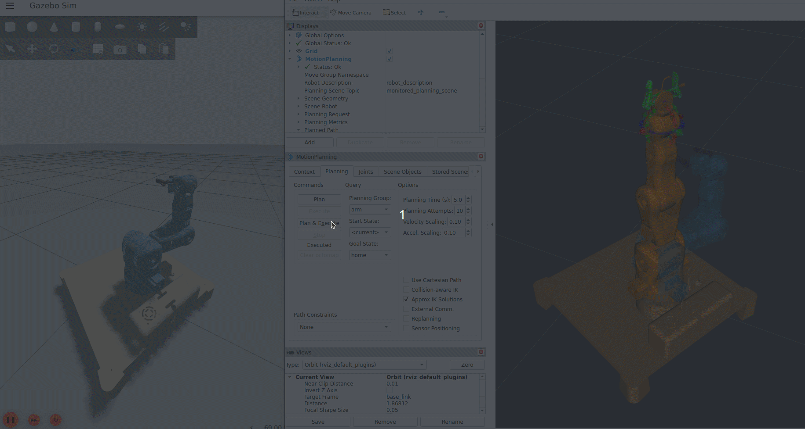
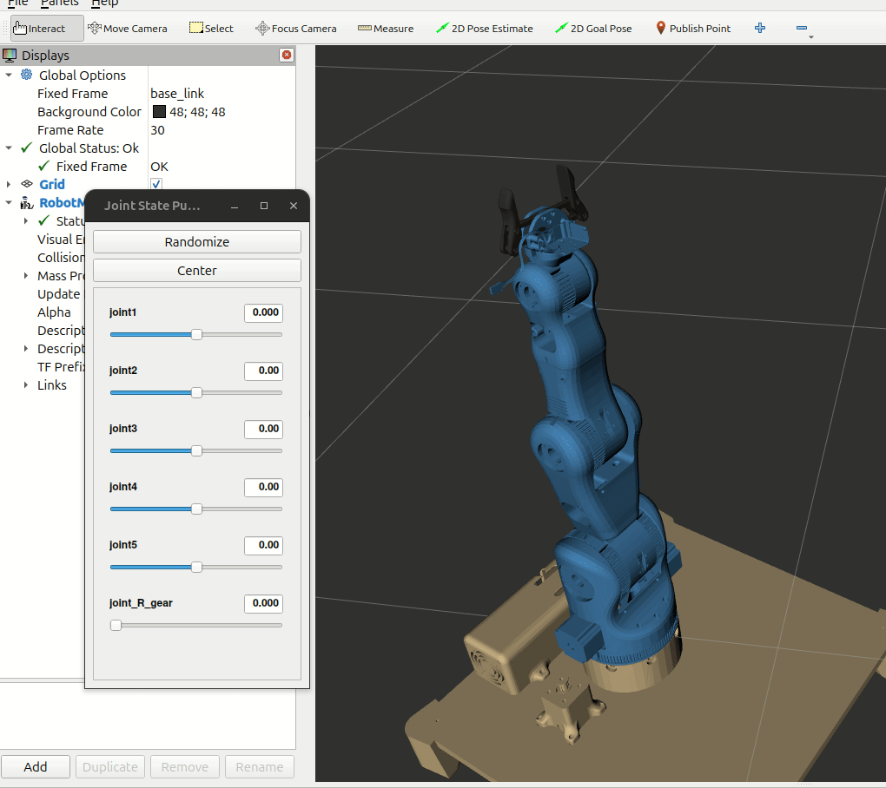

# Moveo Robotic Arm with ROS2



## Overview
This repository contains the ROS2 and MoveIt configuration for the Moveo robotic arm. The project provides a simulation environment and motion planning framework for the 5-DOF Moveo robotic arm, developed for research and educational purposes. Key components include:
- A URDF/Xacro model of the Moveo arm.
- ROS2 integration for controlling the arm's joints and gripper.
- MoveIt2 configuration for advanced motion planning and execution.
- Simulation and visualization in RViz and Gazebo.

### Components:
- **URDF/Xacro Model**: A parameterized model of the robotic arm, allowing you to customize the configuration.
- **ROS2 Control**: Handles communication with hardware or simulated interfaces for real-time control.
- **MoveIt2**: Provides motion planning, kinematics, and trajectory execution for the robotic arm.
- **Gazebo Simulation**: A physics engine for testing and visualizing the arm's movements before deploying to hardware.

## Features
- **5-DOF (Degrees of Freedom)**: Provides flexible movement for a variety of tasks.
- **Gripper Integration**: Supports object manipulation, ideal for pick-and-place tasks.
- **Motion Planning**: Using OMPL for motion planning, with custom controllers for enhanced accuracy.
- **Gazebo Compatibility**: Simulation environment for testing robotic movements without physical hardware.
- **RViz Visualization**: Real-time visualization of the robotic arm's pose, trajectory, and environment.

## Table of Contents
1. [Installation](#installation)
2. [Usage](#usage)
3. [Configuration](#configuration)
4. [Contributing](#contributing)
5. [License](#license)

## Installation
### Prerequisites
Before proceeding with the installation, ensure the following dependencies are installed on your system:

- **Operating System**: Ubuntu 24.04 (or a supported version)
- **ROS2 (Jazzy Jalisco)**: The version of ROS2 required for this project.
- **Rviz**: Visualization tool for interacting with ROS.
- **MoveIt2**: Motion planning framework for ROS2.
- **Gazebo**: Simulation platform for testing robot models.

### Steps to Install
1. **Clone the Repository**:
   Clone this repository to your local machine using the following command:
   ```bash
   git clone https://github.com/JJJau03/moveo_RoboticArm_ROS2.git
2. **Build the workspace**: Navigate to the project folder and build the workspace
   ```bash
   cd moveo_robotic_arm
   colcon build
3. **Source the workspace**: To source the workspace so that ROS2 recognizes the packages, add the following to your ~/.bashrc file
   ```bash
   echo "source /home/<your_username>/moveo_RoboticArm_ROS2/install/setup.bash" >> ~/.bashrc
   source ~/.bashrc
## Usage

### 1. Launch the Gazebo Simulation
This will open the Moveo robotic arm in the Gazebo environment where you can visualize its movements.
   ```bash
   ros2 launch moveo_description gazebo.launch.py
   ```
### 2. Launch RViz with MoveIt
Next, launch RViz with MoveIt2, which will allow you to visualize the arm's movements and plan actions in a 3D environment.
   ```bash
   ros2 launch moveo_moveit_config demo.launch.py
   ```
### 3. Plan the Robot Movements
In RViz, you can interact with the MoveIt2 interface to plan movements for the robotic arm. Use the "Planning" panel to set target poses and manipulate the arm.
### 4. Execute the Plan
Once the movement is planned, you can execute it either through RViz or by using custom ROS2 commands to move the robotic arm in a real or simulated environment.
## Configuration
### URDF Model
The Moveo robotic arm is described using a URDF model (`moveo_description/urdf/moveo_arm.xacro`). You can modify this file to adjust the arm's physical properties or to fit different robot configurations. 


### MoveIt2 Setup
The MoveIt2 configuration files are located in the `moveo_moveit_config` folder. This includes:
- **MoveIt configuration YAML files**: These contain the robot's kinematic chain, motion planning settings, and trajectory constraints.
- **Launch files**: Used to start MoveIt2 and RViz for motion planning and execution.

### Gazebo Simulation
The simulation setup for Gazebo is found in the `moveo_description` directory. You can modify the launch files to adjust the environment or robot behavior within Gazebo.

## Contributing
We welcome contributions to improve this project! If you'd like to contribute, please follow these steps:
1. Fork this repository.
2. Create a new branch for your feature or bug fix.
3. Make changes and commit them.
4. Push your branch and create a pull request.
Make sure to follow the code style and best practices. If you are submitting a bug fix or enhancement, please create an issue first to discuss the changes

## Acknowledgements
- **BCN3D**: The 3D design of the Moveo robotic arm was created by [BCN3D](https://www.bcn3d.com/bcn3d-moveo-the-future-of-learning-robotic-arm/). Their contributions to the physical design of the robot are greatly appreciated.

## License
This project is licensed under the MIT License - see the [LICENSE](LICENSE) file for details.
